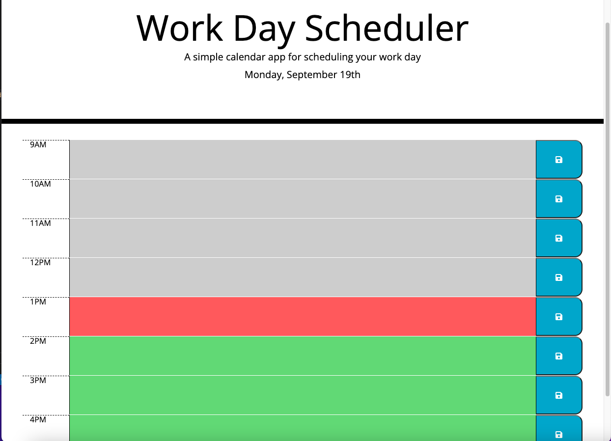

# Work Day Planner

## Description

This application is a simple work day planner that a user can use for schedulling a work day.

## Installation

N/A

## Usage

To use this application you will need to enter the following URL into your browser and hit enter: https://marousiss.github.io/work-day-planner/

Then a simple hourly daily planner will show up on your screen. You can fill out the hourly blocks with your daily events. Every time you enter an event you need to click onto the save button to save that event.

App screenshot:

## Credits

N/A

## License

Please refer to the LICENSE in the repo.
